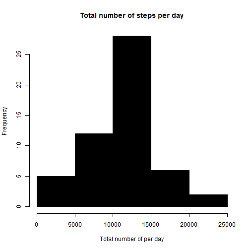
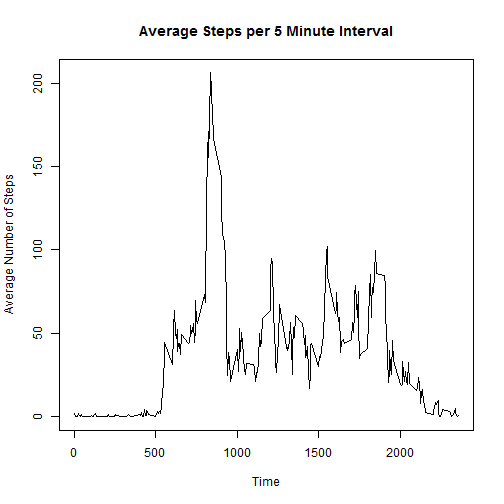
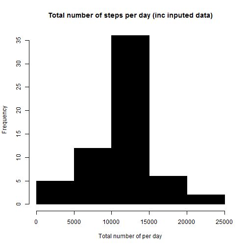
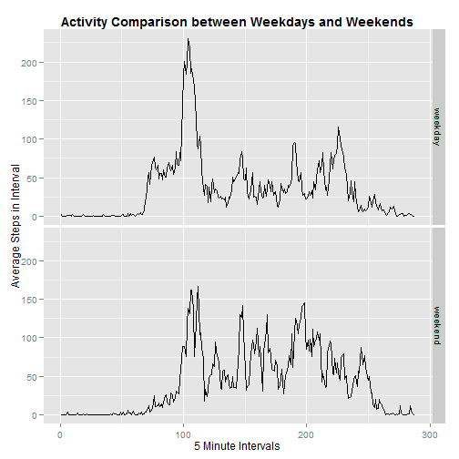

## Loading and preprocessing the data
1. Load the data (i.e. read.csv())
2. Process/transform the data (if necessary) into a format suitable for your
analysis

Set the working directory then download and import the data from the .csv file.


```r
library(knitr)
setwd("~/GitHub/Repro/RepData_PeerAssessment1")

fileurl <- "http://d396qusza40orc.cloudfront.net/repdata%2Fdata%2Factivity.zip"
temp = tempdir()
acttemp = tempfile(tmpdir=temp, fileext=".zip")
download.file(fileurl, acttemp, mode="wb")
activity = unzip(acttemp, list=TRUE)$Name[1]
unzip(acttemp, files=activity, exdir=temp, overwrite=TRUE)
fpath = file.path(temp, activity)
activity <- read.csv("activity.csv", as.is=TRUE)
```

## What is mean total number of steps taken per day?

1. Make a histogram of the total number of steps taken each day


```r
activitynona <- na.omit(activity)

dailystepstot <- aggregate(steps ~ date, activitynona, sum)

hist(dailystepstot$steps, col=1, main="Total number of steps per day", 
     xlab="Total number of per day")
```

 

2. Calculate and report the mean and median total number of steps taken
per day


```r
meands <- mean(dailystepstot$steps)
meands
```

```
## [1] 10766.19
```


```r
mediands <- median(dailystepstot$steps)
mediands
```

```
## [1] 10765
```

## What is the average daily activity pattern?

1. Make a time series plot (i.e. type = "l") of the 5-minute interval (x-axis)
and the average number of steps taken, averaged across all days (y-axis)


```r
intstep <- aggregate(activitynona$steps,by=list(activitynona$interval),FUN=mean)
plot(intstep$Group.1,intstep$x,type="l",main="Average Steps per 5 Minute Interval",ylab="Average Number of Steps", xlab="Time")
```

 

2. Which 5-minute interval, on average across all the days in the dataset,
contains the maximum number of steps?

```r
intstep$Group.1[which.max(intstep$x)]
```

```
## [1] 835
```

## Imputing missing values
1. Calculate and report the total number of missing values in the dataset
(i.e. the total number of rows with NAs)


```r
sum(is.na(activity))
```

```
## [1] 2304
```

2. Devise a strategy for filling in all of the missing values in the dataset. The
strategy does not need to be sophisticated. For example, you could use
the mean/median for that day, or the mean for that 5-minute interval, etc.

I have chosen to use the mean for that 5 minute interval to replace the NA's

3. Create a new dataset that is equal to the original dataset but with the
missing data filled in.


```r
activityinp <- activity
for (row in 1:length(activityinp$steps)){
        if(is.na(activityinp[row,1])){
                activityinp[row,1]=intstep[intstep$Group.1==activityinp[row,3],2]
        }
}
```

4. Make a histogram of the total number of steps taken each day and Calculate
and report the mean and median total number of steps taken per day. 


```r
dailystepstotinp <- aggregate(steps ~ date, activityinp, sum)

hist(dailystepstotinp$steps, col=1, main="Total number of steps per day (inc inputed data)", 
     xlab="Total number of per day")
```

 


```r
meandspi <- mean(dailystepstotinp$steps)
meandspi
```

```
## [1] 10766.19
```


```r
mediandspi <- median(dailystepstotinp$steps)
mediandspi
```

```
## [1] 10766.19
```

Do these values differ from the estimates from the first part of the assignment?
What is the impact of imputing missing data on the estimates of the total
daily number of steps?


```r
#these values will be called in the text comparison statement
meandiff <- meands - meandspi
mediandiff <- round((mediandspi - mediands),2)
```

It can be seen that the difference between the means =0, showing no difference; this should be expected as the inputed data points were based on the mean values for the slots. The median however is different and has become 1.19 closer to the mean. Again this is to be expected due to the NA replacement strategy used.


## Are there differences in activity patterns between weekdays and weekends?

1. Create a new factor variable in the dataset with two levels - "weekday"
and "weekend" indicating whether a given date is a weekday or weekend
day.


```r
activityinp$date <- as.Date(activityinp$date)
activityinp$day <- weekdays(activityinp$date)
activityinp$type <- ifelse(activityinp$day=="Saturday"|activityinp$day=="Sunday","weekend","weekday")
activityinp$type <- as.factor(activityinp$type)
activityinp$interval <- as.factor(activityinp$interval)
```


2. Make a panel plot containing a time series plot (i.e. type = "l") of the
5-minute interval (x-axis) and the average number of steps taken, averaged
across all weekday days or weekend days (y-axis).


```r
library(ggplot2)
dayscomp=aggregate(activityinp$steps,list(as.factor(activityinp$interval),as.factor(activityinp$type)),mean)
p <- ggplot(dayscomp, aes(x = as.integer(Group.1), y=x)) + geom_line()
p + facet_grid(Group.2~.)+xlab("5 Minute Intervals")+ylab("Average Steps in Interval")+ggtitle("Activity Comparison between Weekdays and Weekends")+theme(plot.title = element_text(lineheight=.8, face="bold"))
```

 
